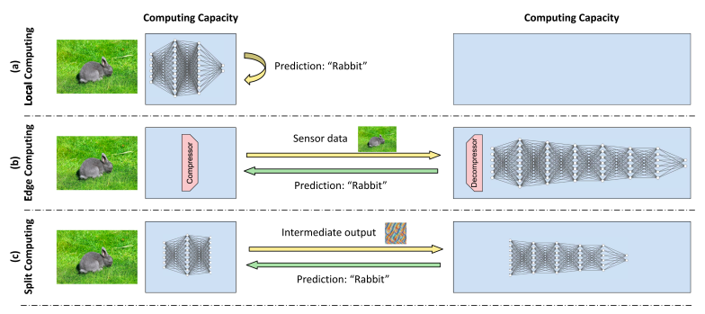

# Split Computing / Supervised Compression

In this section we will modify the model to perform compression as well as inference.
This technique is known as split computing. 
For an introduction see [Matsubara et al](https://dl.acm.org/doi/10.1145/3527155)



First we will understand the motivation
for this design by running `4_split_computing/latency.py`

```bash
$ python 4_split_computing/latency.py 
Full Model
9.0 ms
Encoder Model
2.3 ms
Decoder Model
6.7 ms
Original size: 27648
Compressed size: 2880
```

## Computing Assignment
- Train one split computing model
- Train one split computing model with flexible number of channels 
- Add quantization

Additional Reading:
Slimmable Neural Networks: https://arxiv.org/abs/2306.12691
Flexible Split Computing: https://arxiv.org/abs/1812.08928

### Challenge
- Implement an Entropy Bottleneck model for split compression